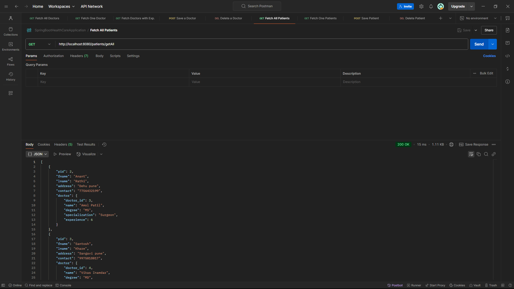

# Spring Boot Healthcare API

## Overview
This project is a **Spring Boot-based REST API** for managing doctors and patients in a healthcare system. It provides endpoints for adding, retrieving, and deleting doctors and patients. The API includes **exception handling**, **input validation**, and follows **RESTful conventions**.

---

## Technologies Used
- **Spring Boot** (Spring MVC, Spring Data JPA)
- **Hibernate** (JPA for database operations)
- **MySQL** (or any relational database)
- **Postman** (for API testing)
- **Spring Boot Exception Handling**

---

## Features
- **CRUD operations** for **Doctors** and **Patients**
- **Custom Exception Handling** for better error management
- **Centralized Exception Handling** using `@ControllerAdvice`
- **RESTful API design**
- **Proper validation** to prevent invalid data from being stored

---

## API Endpoints

### **Doctor Endpoints**
| Method | Endpoint                 | Description |
|--------|--------------------------|-------------|
| GET    | `/getAllDoctors`         | Fetch all doctors |
| GET    | `/getOneDoctor/{id}`     | Fetch a doctor by ID |
| GET    | `/getDoctors/{exp}/{spec}` | Get doctors by experience and specialization |
| POST   | `/saveDoctor`            | Add a new doctor |
| DELETE | `/deleteDoctor/{id}`     | Delete a doctor by ID |

### **Patient Endpoints**
| Method | Endpoint                 | Description |
|--------|--------------------------|-------------|
| GET    | `/getAllPatients`        | Fetch all patients |
| GET    | `/getOnePatient/{id}`    | Fetch a patient by ID |
| POST   | `/savePatient`           | Add a new patient (assigns a doctor) |
| DELETE | `/deletePatient/{id}`    | Delete a patient by ID |

---

## Exception Handling
The project includes custom exception handling to ensure better error messages and responses.

### **Custom Exceptions**
- `DoctorNotFoundException` – Thrown when a doctor is not found.
- `PatientNotFoundException` – Thrown when a patient is not found.
- `InvalidInputException` – Thrown when invalid data is provided.

### **Global Exception Handler (`GlobalExceptionHandler.java`)**
- Uses `@ControllerAdvice` to handle exceptions globally.
- Returns **meaningful error messages** with proper HTTP status codes.

---

## Testing the API (Postman Screenshots)
Below are the screenshots of **Postman API testing**:

### **1. Fetch All Doctors**


### **2. Fetch One Doctor**


### **3. Fetch Specific Doctors with required Experience & Specialization**


### **4. Save a Doctor**


### **5. Delete a Doctor**


### **6. Fetch All Patients**


### **7. Fetch One Patients**


### **8. Save a Patient**


### **9. Delete a Patient**


---

## Setup Instructions

### **1. Clone the repository**

```sh
git clone https://github.com/ro-nav/SpringBootHealthCare.git
cd SpringBootHealthCare
```

### **2. Configure the Database**

Update `application.properties` with your database credentials:

```properties
spring.datasource.url=jdbc:mysql://localhost:3306/healthcare
spring.datasource.username=yourusername
spring.datasource.password=yourpassword
spring.jpa.hibernate.ddl-auto=update
```

### **3. Run the application**

```sh
mvn spring-boot:run
```

---

## Author

**Rohan Bhapkar**\
For any queries, feel free to contact me!

---

## Contributing
If you find a bug or have suggestions, feel free to **open an issue** or **submit a pull request**.

---

## License

This project is licensed under the MIT License.
